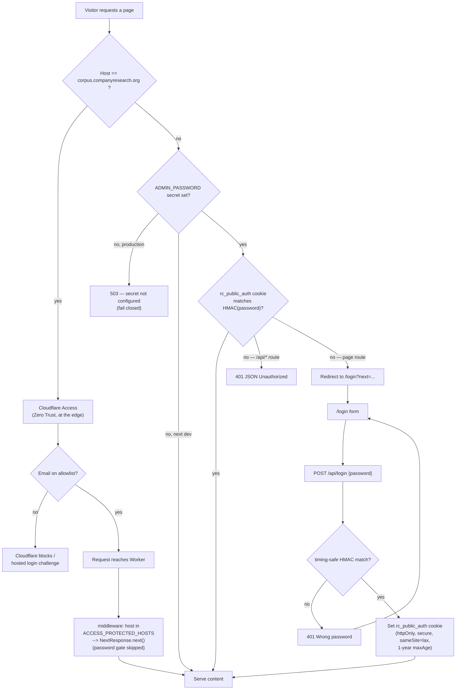

# Public Viewer Access Control

How visitors authenticate to the public research viewer, and why the two public
hostnames behave differently.

## Overview

`corpus.companyresearch.org` and `public.research.us.kg` are two custom domains
routed to the **same** Cloudflare Worker (`research-portal-public`). They serve
identical content and reach the same data (Supabase + the R2 `research-portal`
bucket). The only difference is **where authentication happens**, which is
decided by hostname in [`src/middleware.ts`](../src/middleware.ts).

| | `corpus.companyresearch.org` | `public.research.us.kg` (and `*.workers.dev`) |
|---|---|---|
| Gate location | Cloudflare edge, **before** the Worker | **Inside** the Worker (`middleware.ts`) |
| Mechanism | Cloudflare Access (Zero Trust) | HMAC password cookie |
| Credential | Email allowlist identity | Single shared `ADMIN_PASSWORD` |
| Managed in | Cloudflare dashboard (not in repo) | `ADMIN_PASSWORD` secret + this code |
| Identity granularity | Per-person | None (one shared secret) |
| Worker password check | Skipped (`NextResponse.next()`) | Enforced |
| Login UI | Cloudflare's hosted login | `/login` page in this app |

## Workflow



## `corpus.companyresearch.org` — Cloudflare Access (Zero Trust)

```
Browser -> Cloudflare Access (edge) -> [email allowlist gate] -> Worker -> content
```

1. The hostname is listed in `ACCESS_PROTECTED_HOSTS` (`middleware.ts`).
2. **Cloudflare Access intercepts the request at the edge, before it reaches
   the Worker.** The visitor authenticates against a Zero Trust email allowlist
   (Google / OTP login configured in the Cloudflare dashboard — not in this
   repo).
3. Because Access already vetted the request, the Worker middleware matches the
   host and returns `NextResponse.next()` immediately — **the password gate is
   skipped**.

**Auth model:** identity-based (who you are, by email). Managed entirely outside
the codebase.

## `public.research.us.kg` — in-Worker password gate

```
Browser -> Worker middleware -> [cookie check] -> content
                             \-> no/bad cookie -> /login -> POST /api/login -> cookie
```

This is also the path for any `*.workers.dev` production or preview URL — any
hostname **not** in `ACCESS_PROTECTED_HOSTS`.

1. The middleware reads `ADMIN_PASSWORD` (a Worker secret, synced from GitHub by
   the deploy workflow). If unset: **503 in production** (fail closed), open
   under `next dev` without `.dev.vars`.
2. It looks for the `rc_public_auth` cookie and compares it (timing-safe)
   against `authToken(password)`.
3. On a miss: `/api/*` routes return `401 JSON`; page routes redirect to
   `/login?next=<original path>`.
4. The `/login` page posts the password to `POST /api/login`
   ([`route.ts`](../src/app/api/login/route.ts)), which on success sets a
   stateless cookie: `httpOnly`, `secure` (in production), `sameSite=lax`,
   1-year `maxAge`.

### The cookie

The cookie value is **HMAC-SHA256 of the fixed label `"research-public-viewer"`
keyed by the admin password** ([`src/lib/auth.ts`](../src/lib/auth.ts)).

- Nothing is stored server-side — the token is self-verifying.
- Rotating `ADMIN_PASSWORD` instantly invalidates every issued cookie.
- Login comparison is timing-safe and compares HMACs (not raw strings), so it
  stays constant-time even for wrong-length guesses.

**Auth model:** shared-secret password (what you know). Anyone with the password
gets in; there is no per-user identity.

## Notes & caveats

1. **The corpus host trusts the `Host` header.** The Worker skips its own gate
   for `corpus.companyresearch.org`. If a request could reach the Worker with
   that `Host` header *without* traversing Cloudflare Access (e.g. hitting the
   `*.workers.dev` origin directly while spoofing the header), it would bypass
   auth. Confirm the `workers.dev` route is disabled or itself gated, and that
   Cloudflare normalizes the Host on the custom domain.
2. **Both front doors reach identical capabilities** — the same Supabase
   service-role key and R2 bucket binding. The writable *My Research* vs.
   read-only *Corpus* split is enforced in the API route handlers, **not** in
   the auth layer.
3. The password path fails closed in production (503 when the secret is unset)
   and uses timing-safe comparison in both the middleware and the login route.

## Relevant files

| File | Role |
|------|------|
| [`src/middleware.ts`](../src/middleware.ts) | Host-based routing between the two gates; cookie check; redirects |
| [`src/lib/auth.ts`](../src/lib/auth.ts) | `ADMIN_PASSWORD` resolution, HMAC token, timing-safe compare |
| [`src/app/api/login/route.ts`](../src/app/api/login/route.ts) | Verifies the password and sets the auth cookie |
| [`src/app/login/page.tsx`](../src/app/login/page.tsx) | Login form (posts to `/api/login`) |
| [`wrangler.jsonc`](../wrangler.jsonc) | Worker config; `ADMIN_PASSWORD` is a dashboard secret |
